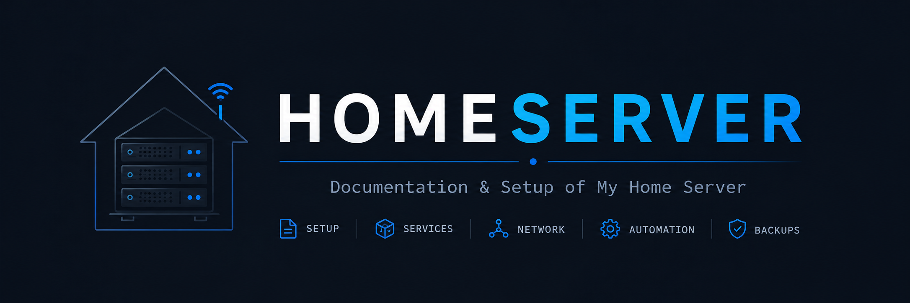

> [!WARNING]
> At the moment the server is not fully set up and running. See the [plan](./plan.md) for details on the implementation steps and current status.

This is the documentation for a self-hosted homeserver running own projects, open source web services and applications with security-first architecture using Cloudflare Tunnel and Dokploy.

A Minecraft server may also be hosted on the same machine in the future.

> [!NOTE]
> This is a personal project for self-hosting web applications. The documentation is primarily for my own reference but may be useful to others interested in similar setups. If you have experience with self-hosting, Cloudflare Tunnel, or Dokploy, please feel free to share your insights by creating an issue. 
> If you have a security concern see [security](./security.md).

## Services
| Service | Description                       | Status       | Location                           |
| ------- | --------------------------------- | ------------ | ---------------------------------- |
| Dokploy | Docker-based deployment dashboard | Not Deployed | dash.example.com (Cloudflare Tunnel) |

All other services are managed by Dokploy and will be listed here once deployed.

## Further Documentation

| Document       | Description                            | Link |
| -------------- | -------------------------------------- | ---- |
| Basic OS Setup | User management, initial configuration | ---- |
| Security       | fail2ban, unattended upgrades, etc.    | ---- |
| Networking     | SSH, UFW                               |      |